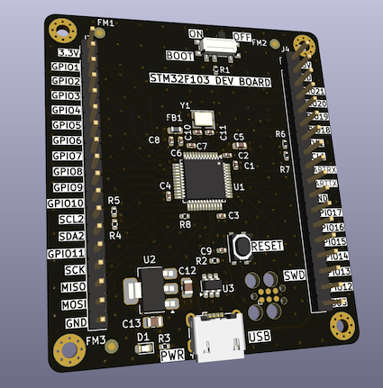
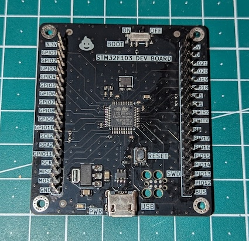

# STM32F103 Development Board

This repo contains the [KiCad](https://www.kicad.org/) hardware design files for a development board for the `STM32F103` MCU, which is somewhat similar to the well known blue pill board. The design(er) has greatly benefitted from some of [Phil Salmony's](https://www.phils-lab.net/) designs :pray:.

## Features

- STM32F103 MCU
  - 2x I2C (pull up resistors included)
  - SPI (22R series termination resistor included)
  - USB micro
  - UART
  - 21 GPIOs
- 16MHz crystal
- ESD protection
- SWD via legged 6-pin plug-of-nails tag-connect connector
- BOOT0 pin toggle switch
- NRST pin push button
- Power LED
- LDO voltage regulator

## Manufacturing

All files necessary for manufacturing the board at the pcb manufacturer of your choice can be found in `./manufacturing_r0.1`. This includes the drill files, gerbers, bill of materials and a basic assembly drawing.

Fully manufactured version of the board:

